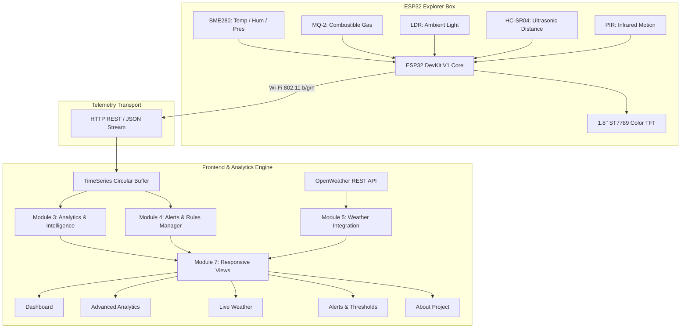

# Smart ESP32 Multi-Sensor Explorer Box — Web Dashboard

[](https://github.com/Samar-365/Smart-ESP32-Multi-Sensor-Explorer-Box)
[](https://www.espressif.com/)
[](https://vitejs.dev/)
[](LICENSE)

An IoT-based environmental telemetry and health monitoring platform built according to the **Software Requirements Specification (SRS v1.0)**. The system pairs a physical dual-core **ESP32 Multi-Sensor Explorer Box** with a web dashboard for live telemetry streaming, descriptive statistics, directional trend regression, threshold violation tracking, and statistical anomaly detection.

---

## System Architecture Pipeline



---

## Key Features

### 1. Main Live Dashboard (SRS FR-01 & FR-02)
- **7 Live Sensor Cards**:
  - **Temperature** (BME280, °C): Status tag, daily min/max, directional trend.
  - **Humidity** (BME280, %): Relative humidity with indoor comfort balance tags.
  - **Barometric Pressure** (BME280, hPa): Ambient sea-level barometric tracker.
  - **Gas Level** (MQ-2, ppm): Combustible gas and smoke safety monitoring.
  - **Light Intensity** (LDR, ADC): 10-bit daylight & ambient lighting index.
  - **Ultrasonic Distance** (HC-SR04, cm): Proximity warning and clearance bars.
  - **PIR Motion Sensor**: Animated pulsating radar concentric rings showing trigger pulses.
- **Environmental Comfort Score Widget (FR-04.6)**:
  - Circular SVG progress dial (0–100) combining thermal comfort (ASHRAE-55), relative humidity balance, air purity (MQ-2), and barometric pressure.
  - Classifies indoor environment into `GOOD`, `MODERATE`, or `POOR`.
  - Displays checkmarks (`✓` / `⚠`) for individual factors and actionable indoor ventilation advice.
- **Streaming Telemetry Charts**: Real-time Chart.js spline curves for Temperature and Humidity.
- **Live Weather Card & Recent Alerts Ticker**: Highlighting the latest 4 safety events.

### 2. Advanced Analytics Suite (SRS FR-04.1 to FR-04.9)
- **Trends (FR-04.1 & FR-04.3)**:
  - Interactive spline line chart with selectable time ranges (`1h`, `6h`, `24h`, `7d`, `all`).
  - Directional momentum classification: `Increasing ↗`, `Decreasing ↘`, `Stable →`, or `Rapidly Changing`.
  - Rate of change velocity ($\Delta x / \Delta t$ per hour).
- **Descriptive Statistics Matrix (FR-04.2)**:
  - Calculates Current, Min, Max, Mean ($\mu$), Population Standard Deviation ($\sigma$), and Rate of Change for all 6 numerical sensors.
- **Dual-Axis Sensor Comparison (FR-04.5)**:
  - Synchronized dual Y-axis curves (`y1` and `y2`) for pairs like *Temp vs Humidity*, *Temp vs Pressure*, *Gas vs Light*.
  - Calculates Pearson Correlation Coefficient ($r$) to identify environmental cross-relationships.
- **Threshold Violation & Compliance Tracker (FR-04.4)**:
  - Tracks status (`NORMAL` / `HIGH`), discrete violation episode counts, peak breach magnitude, and cumulative time spent above limit.
- **Statistical Anomaly Detection (FR-04.7)**:
  - Rolling Z-Score ($Z = \frac{x - \mu}{\sigma}$) outlier detection flagging sudden abnormal spikes ($|Z| \ge 2.5\sigma$).
- **Spatial Intelligence (FR-04.8 & FR-04.9)**:
  - 24-hour PIR motion activity histogram bar chart, peak activity time windows (e.g. `14:00–16:00`), and daily event counters.
  - HC-SR04 ultrasonic distance distribution and approach velocity tracking.

### 3. Live Weather & Differential Analysis (SRS FR-03)
- Connects to OpenWeather REST API (Outdoor temperature, feels-like, condition icon, humidity, wind speed, pressure, visibility).
- **Indoor vs Outdoor Differential Card**: Computes real-time deltas ($\Delta T$, $\Delta H$, $\Delta P$) between physical ESP32 indoor sensors and outdoor ambient air, providing HVAC efficiency and natural ventilation advisories.
- 6-hour hourly progression ribbon and 5-day daily forecast.
- City search and custom API key configuration drawer.

### 4. Alerts & Threshold Management (SRS FR-05, FR-06, Section 4.2)
- Multi-tier alert classifier (`Normal`, `Warning`, `Critical`).
- Stateful edge-triggered deduplication tracker preventing repeated spam during continuous telemetry streaming.
- Filterable Historical Alerts Table matching SRS schema (`Time | Sensor | Value | Status | Context`).
- Search box and filters by Sensor, Severity Level, and Date Range.
- **Administrator Threshold Configuration Modal**: Allows configuring Warning ($\ge$) and Critical ($\ge$) thresholds with factory reset.

### 5. One-Click CSV Data Export (SRS FR-09)
- Instant RFC 4180 compliant CSV export generating `esp32_sensor_data_YYYYMMDD_HHMMSS.csv` matching the SRS format:
  ```csv
  timestamp,temperature,humidity,pressure,gas,light,distance,motion
  2026-09-07T00:00:00.000Z,29.6,63.0,1008.0,320,735,24.0,0
  ```

### 6. Dual Data Layer & Fault Injection Simulator
- **Live Device Mode**: Connects directly to physical ESP32 at `http://<esp32-ip>/api/data` with an automated watchdog that flags `OFFLINE` if packet delivery ceases for $>9\text{s}$.
- **Physics Simulator Mode**: Built-in realistic generator with natural diurnal waves and Gaussian noise.
- **Hazard Injection Panel**: Interactive floating panel to test gas spikes (650 ppm), temperature jumps (+7°C), motion bursts, obstacle approaches (4 cm), and offline disconnects.

---

## Hardware Pinout & Wiring Specifications

| Component | Parameter | Interface | ESP32 GPIO Pin | Voltage Rail | Notes |
| :--- | :--- | :--- | :--- | :--- | :--- |
| **BME280** | Temp, Humidity, Pressure | I2C Bus | **SDA: GPIO 21**, **SCL: GPIO 22** | 3.3V | Address: `0x76` or `0x77` |
| **MQ-2** | Combustible Gas & Smoke | Analog (ADC1) | **A0: GPIO 34** (ADC1_CH6) | 5.0V (VIN) | 5V heater, 3.3V ADC safe |
| **LDR** | Ambient Light Intensity | Analog (ADC1) | **Divider: GPIO 35** (ADC1_CH7) | 3.3V | 10 kΩ pull-down resistor |
| **HC-SR04** | Ultrasonic Proximity | Digital Pulse | **Trig: GPIO 5**, **Echo: GPIO 18** | 5.0V (VIN) | 1kΩ/2kΩ divider on Echo |
| **PIR HC-SR501**| Infrared Motion | Digital Input | **OUT: GPIO 13** | 5.0V (VIN) | 3.3V logic output |
| **ST7789 TFT** | Local Color Display | Hardware SPI | **MOSI: 23**, **SCK: 18**, **CS: 15**, **DC: 2**, **RST: 4** | 3.3V | 240x240 RGB display |

---

## ESP32 Firmware Installation

The complete production-ready firmware is available in [`firmware/SmartExplorerBox.ino`](firmware/SmartExplorerBox.ino).

### Prerequisites
1. Install [Arduino IDE](https://www.arduino.cc/en/software) or PlatformIO.
2. Add ESP32 board support via Boards Manager: `https://raw.githubusercontent.com/espressif/arduino-esp32/gh-pages/package_esp32_index.json`.
3. Install the required libraries via the Arduino Library Manager:
   - `Adafruit Unified Sensor`
   - `Adafruit BME280 Library`
   - `ArduinoJson` (v6.x)

### Flashing
1. Open [`firmware/SmartExplorerBox.ino`](firmware/SmartExplorerBox.ino).
2. Configure your Wi-Fi credentials:
   ```cpp
   const char* WIFI_SSID = "YOUR_WIFI_SSID";
   const char* WIFI_PASSWORD = "YOUR_WIFI_PASSWORD";
   const char* SERVER_ENDPOINT = "http://YOUR_COMPUTER_IP:3000/api/telemetry";
   ```
3. Select board **ESP32 Dev Module**, choose the correct COM port, and click **Upload**.
4. Open the Serial Monitor at **115200 baud** to verify sensor initialization and Wi-Fi connection.

---

## Web Dashboard Quick Start

### Prerequisites
- Node.js (v18.0 or newer)
- npm (v9.0 or newer)

### Installation & Execution

```bash
# Clone the repository
git clone https://github.com/Samar-365/Smart-ESP32-Multi-Sensor-Explorer-Box.git
cd Smart-ESP32-Multi-Sensor-Explorer-Box

# Install dependencies (Vite, Chart.js)
npm install

# Start development server
npm run dev

# Build production bundle
npm run build

# Preview production build
npm run preview
```

Open [http://localhost:3000](http://localhost:3000) in your web browser.

---

## Automated Test Verification

The project includes unit test suites validating each individual module:

```bash
# Test Module 2 (Telemetry & Ingestion)
node tests/test_telemetry.js

# Test Module 3.1 (Statistical Engine)
node tests/test_submodule_3_1.js

# Test Module 3.2 (Trend & Velocity Detector)
node tests/test_submodule_3_2.js

# Test Module 3.3 (Threshold Violation Tracker)
node tests/test_submodule_3_3.js

# Test Module 3.4 (Sensor Cross-Correlation)
node tests/test_submodule_3_4.js

# Test Module 3.5 (Environmental Comfort Score)
node tests/test_submodule_3_5.js

# Test Module 3.6 (Anomaly & Spatial Intelligence)
node tests/test_submodule_3_6.js

# Test Module 4.1 (Threshold Config Store)
node tests/test_submodule_4_1.js

# Test Module 4.2 (Rule Evaluator)
node tests/test_submodule_4_2.js

# Test Module 4.3 (Historical Alert Logging)
node tests/test_submodule_4_3.js

# Test Module 5 (Weather & Differential Comparator)
node tests/test_module_5.js

# Test Module 8.1 (Hardware Pinouts)
node tests/test_submodule_8_1.js

# Test Module 8.2 (Arduino Firmware)
node tests/test_submodule_8_2.js
```

---

## Acceptance Criteria Verification (SRS Section 30)

| ID | Requirement | Status | Implementation Reference |
| :--- | :--- | :---: | :--- |
| **AC-01** | Dashboard displays current ESP32 sensor values | Complete | [`dashboardView.js`](src/modules/ui/views/dashboardView.js) |
| **AC-02** | Temperature, humidity, and pressure are displayed | Complete | [`sensorSchema.js`](src/modules/telemetry/sensorSchema.js) |
| **AC-03** | Gas, light, distance, and motion are displayed | Complete | [`dashboardView.js`](src/modules/ui/views/dashboardView.js) |
| **AC-04** | Sensor readings update automatically | Complete | [`main.js`](src/main.js), [`simulator.js`](src/modules/telemetry/simulator.js) |
| **AC-05** | Weather information is displayed | Complete | [`weatherView.js`](src/modules/ui/views/weatherView.js), [`weatherClient.js`](src/modules/weather/weatherClient.js) |
| **AC-06** | Historical sensor graphs can be viewed | Complete | [`analyticsView.js`](src/modules/ui/views/analyticsView.js), [`chartManager.js`](src/modules/ui/chartManager.js) |
| **AC-07** | Min, max, and average values are calculated | Complete | [`statsEngine.js`](src/modules/analytics/statsEngine.js) |
| **AC-08** | Sensor trends can be identified | Complete | [`trendDetector.js`](src/modules/analytics/trendDetector.js) |
| **AC-09** | Two sensor parameters can be compared | Complete | [`sensorComparison.js`](src/modules/analytics/sensorComparison.js) |
| **AC-10** | Threshold violations generate alerts | Complete | [`alertRules.js`](src/modules/alerts/alertRules.js) |
| **AC-11** | Historical alerts can be viewed | Complete | [`alertsView.js`](src/modules/ui/views/alertsView.js), [`alertHistory.js`](src/modules/alerts/alertHistory.js) |
| **AC-12** | ESP32 online/offline status is displayed | Complete | [`deviceConnector.js`](src/modules/telemetry/deviceConnector.js), [`layout.css`](src/modules/ui/styles/layout.css) |
| **AC-13** | Basic anomaly detection works | Complete | [`anomalyDetector.js`](src/modules/analytics/anomalyDetector.js) |
| **AC-14** | Environmental comfort score can be displayed | Complete | [`comfortScore.js`](src/modules/analytics/comfortScore.js) |
| **AC-15** | Website is usable on mobile and desktop | Complete | [`layout.css`](src/modules/ui/styles/layout.css), [`components.css`](src/modules/ui/styles/components.css) |

---

## License

This project is licensed under the MIT License — see the [LICENSE](LICENSE) file for details.
